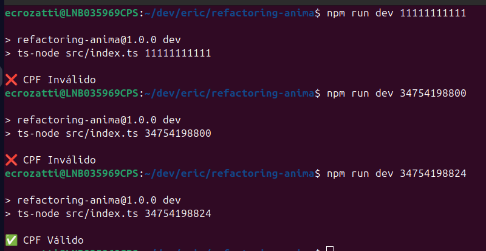
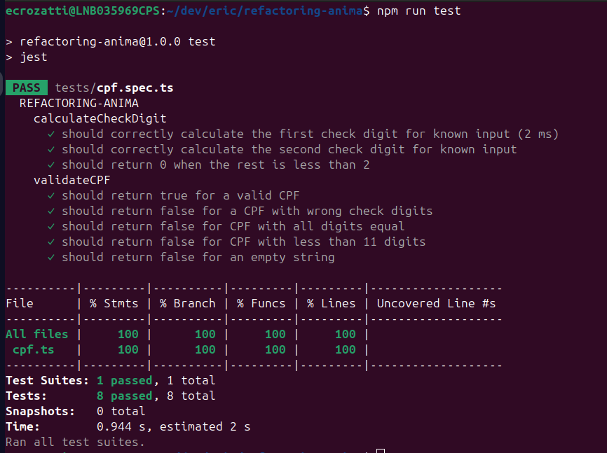

# 🧮 Validador de CPF (TypeScript)

Projeto desenvolvido como teste para uma vaga interna, com o objetivo de implementar e refatorar uma função de validação de CPF em TypeScript, aplicando boas práticas de desenvolvimento, testes automatizados com Jest e ferramentas de qualidade como ESLint e Prettier.

Obs.: adicionei alguns comentários explicativos no código só para facilitar o entendimento da lógica durante a avaliação. Costumo manter o código mais limpo em projetos reais, mas achei válido nesse contexto.

---

## ✅ Requisitos validados

- CPFs deve conter 11 dígitos numéricos.
- Podem conter ou não pontuação (`.` e `-`).
- CPFs com todos os dígitos iguais são considerados inválidos.

---

## ⚙️ Como rodar o projeto

### 1. Instale as dependências
```bash
npm install
```

### 2. Rode os testes
```bash
npm test
```

### 3. Rode via terminal

Execute o comando abaixo com um CPF como parâmetro:
```bash
npm run dev 639.725.330-98
```

---

## 🧪 Testes

Os testes foram escritos com **Jest**, seguindo a abordagem **BDD (Behavior-Driven Development)**, utilizando os blocos `Given`, `When`, `Then` para clareza dos cenários:

### Exemplos de cenários testados:

**calculateCheckDigit**
- ✅ Deve calcular corretamente o primeiro dígito verificador
- ✅ Deve calcular corretamente o segundo dígito verificador
- ✅ Deve retornar `zero` caso a base numérica seja inválida ou incompleta

**validateCPF**
- ✅ CPF válido → deve retornar `true`
- ❌ CPF com dígitos verificadores errados → deve retornar `false`
- ❌ CPF com todos os dígitos iguais → deve retornar `false`
- ❌ CPF com tamanho inválido → deve retornar `false`
- ❌ CPF vazio → deve retornar `false`

---

## ✨ Boas práticas aplicadas

| Prática | Descrição |
|--------|-----------|
| **SRP (Single Responsibility Principle)** | A função `validateCPF` faz apenas a validação, seguindo o princípio da responsabilidade única. |
| **Early return** | Torna o código mais limpo, evitando indentação desnecessária. |
| **Função modularizada** | `calculateCheckDigit` está separada para evitar repetição e facilitar testes isolados. |
| **Regex** | Usado para limpar a entrada (remover `.`, `-`, espaços) e identificar CPFs inválidos com todos os dígitos iguais. |
| **Testes automatizados** | Garantem segurança ao código e facilitam manutenção. |
| **Lint e Prettier** | Garantem padronização e legibilidade do código. |

---

## 📁 Estrutura do projeto

```
.
├── src/
│   └── cpf.ts              # Função principal de validação de CPF
├── tests/
│   └── cpf.spec.ts         # Testes unitários com Jest
├── jest.config.ts          # Configuração do Jest
├── tsconfig.json           # Configuração do TypeScript
├── .eslintrc.json          # Regras do ESLint
├── .prettierrc             # Configurações do Prettier
├── package.json
└── README.md
```

---

## 🔧 Scripts disponíveis

```json
"scripts": {
  "dev": "tsx watch src/index.ts",
  "test": "jest",
  "lint": "eslint 'src/**/*.ts'",
  "lint:fix": "eslint 'src/**/*.ts' --fix",
  "format": "prettier --write 'src/**/*.ts'"
},
```

---

## 📦 Principais dependências utilizadas

- `typescript` - Tipagem estática e compilação TS → JS
- `jest` + `ts-jest` - Testes automatizados com suporte a TypeScript
- `eslint` - Linter para garantir padrões de código
- `prettier` - Formatter para manter o estilo consistente

---

## 📌 Requisitos para rodar o projeto

- Node.js (v18+ recomendado)
- npm ou yarn
- TypeScript
- Jest (`ts-jest`)
- ESLint (v8+)
- Prettier

---

## 🎯 Resultados obtidos

- Rodando via terminal com alguns CPFs:


- Rodando os testes:

